# L2TP/IPsec on MikroTik RouterOS tutorial

This tutorial will guide you to quickly setup L2TP/IPSec VPN using  [WinBox](https://www.mikrotik.com/download).

Tools used:
* WinBox v6.41
* RB951G-2HnD

Clients which have been tested and are able to connect:
* iOS v11.2.1
* Windows 10 (1709)

## L2TP setup

In the PPP menu, select Interface tab and click `L2TP Server` button.

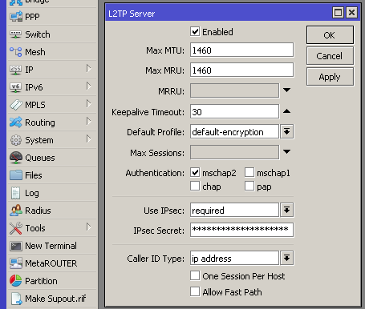

Profile used:

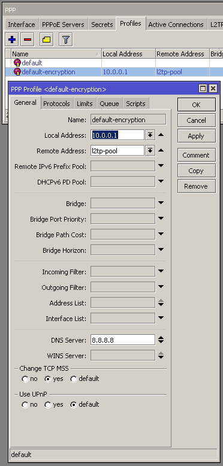

Local Address is set to the internal IP address for MikroTik.
Remote Address is taken from the pool and will be assigned to the connected client.

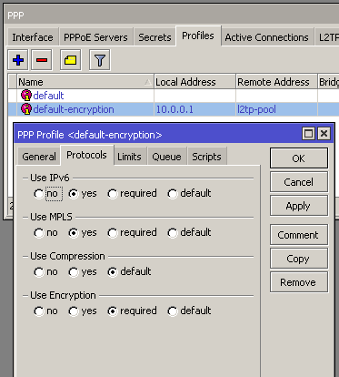

IP Pool example:

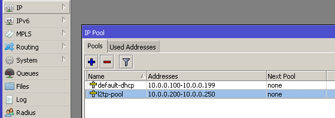

Make sure that the VPN client IP address range does not overlap with an existing range.

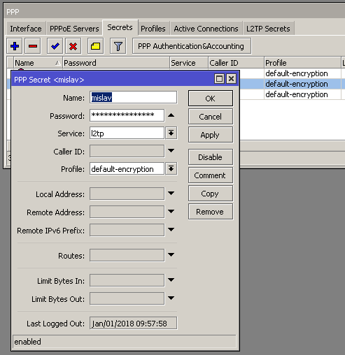

Add client accounts.

## IPSec setup

In the ``IP`` menu select ``IPSec``. Create new peer as shown:

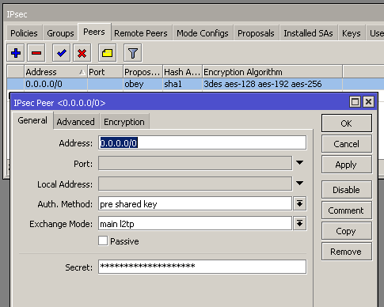

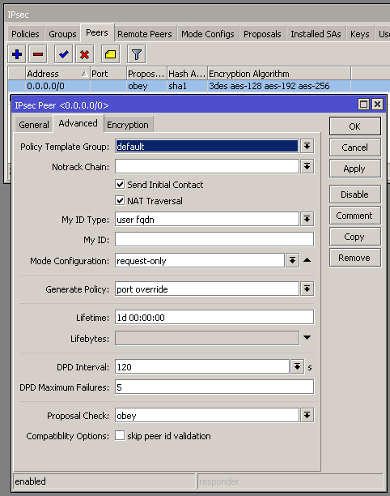

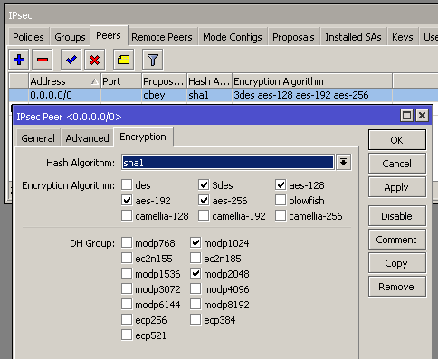

Set up IPSec proposal.

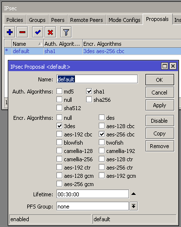

## Firewall

To allow outside connections accept UDP on ports 500, 1701 and 4500.

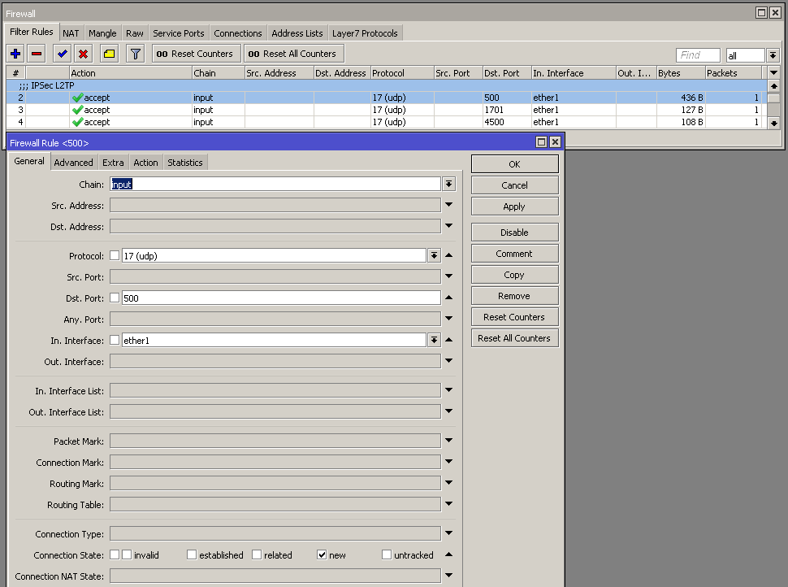

If you would like to apply firewall rules per user, you can set up bindings.

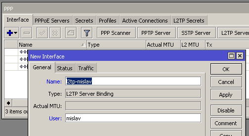

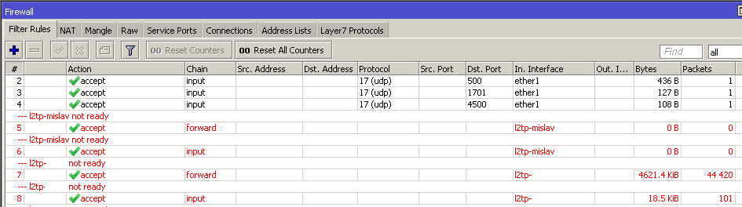


## FAQ

Q1. Windows 10 client completes IPSec phase 1, but is stuck after that. What is needed to complete the L2TP circuit?

A1. On the client, start PowerShell as Administrator. Execute the following command and reboot the PC.

```PowerShell
Set-ItemProperty HKLM:\SYSTEM\CurrentControlSet\Services\PolicyAgent -Name AssumeUDPEncapsulationContextOnSendRule -Value 2 -Type DWord
```
